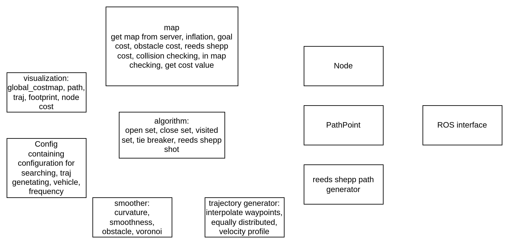

# Hybrid-Astar-Planner2
This is a main content of my master thesis. When reviewing old planner, I found many problems and now want to reconstruct and optimize the planner. Also this repo is to do some basic CI/CD practice and unit test exercises.

## Structure

## TODO:
- Units:
- [ ] Map
- [ ] Algorithm
- [ ] Node
- [ ] PathPoint
- [ ] Config
- [ ] TrajactoryGenerator
- [ ] Smoother
- [ ] RSPathGenerator
- [ ] Visualization
- [ ] ROSInterface
- Tests:
- [ ] Map
- [ ] Algorithm
- [ ] Node
- [ ] PathPoint
- [ ] Config
- [ ] TrajactoryGenerator
- [ ] Smoother
- [ ] RSPathGenerator
- [ ] Visualization
- [ ] ROSInterface

